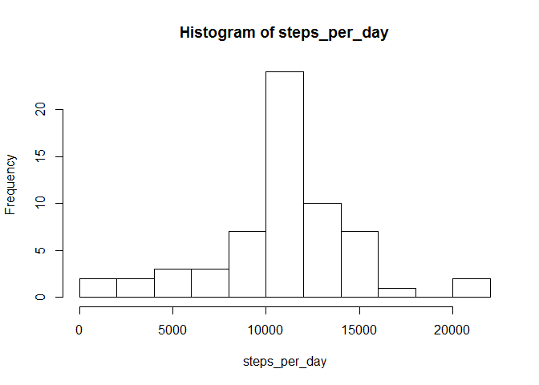

# Reproducible Research: Peer Assessment 1


## Loading and preprocessing the data
Unzipping, loading and transforming data


```r
unzip("activity.zip")
data<-read.csv("activity.csv")
data$date<-as.Date(data$date,"%Y-%m-%d")
```


## What is mean total number of steps taken per day?
1. Histogram of the total number of steps taken per day:

```r
na.mean<-function(x) z<-mean(x,na.rm=TRUE)
steps_per_day<-tapply(data$steps, data$date,sum)
hist(steps_per_day,breaks=10)
```

 


2. Mean of the total number of steps taken per day

```r
mean<-mean(steps_per_day,na.rm=TRUE)
print(paste("Mean steps per day:", mean))
```

```
## [1] "Mean steps per day: 10766.1886792453"
```
3. Median of the total number of steps taken per day 

```r
median<-median(steps_per_day,na.rm=TRUE)
print(paste("Median steps per day:", median))
```

```
## [1] "Median steps per day: 10765"
```
## What is the average daily activity pattern?
1. Time series plot with highlighted maximum value

```r
steps_per_interval<-tapply(data$steps, data$interval,na.mean)
plot(x=names(steps_per_interval),y=steps_per_interval,type="l")
points(x=names(which(steps_per_interval==max(steps_per_interval))),y=max(steps_per_interval), col="red", lwd=4)
```

 


2. Interval with maximum number of steps:

```r
print(paste("Interval with maximum steps: ",names(which(steps_per_interval==max(steps_per_interval)))))
```

```
## [1] "Interval with maximum steps:  835"
```
## Imputing missing values
1. Total number of missing values

```r
sum(as.integer(is.na(data$steps)))
```

```
## [1] 2304
```
2. Replacing missings by mean for 5 min interval in a new dataset

```r
data.na<-data
ind<-which(is.na(data.na$steps))
for (i in ind){
        for (j in names(steps_per_interval)){
                if (data.na$interval[i]==as.integer(names(steps_per_interval[j]))){
                        data.na$steps[i]<-steps_per_interval[j]
                }
        }
}    
```
3. Histogram of the total number of steps taken per day:

```r
steps_per_day<-tapply(data.na$steps, data.na$date,sum)
hist(steps_per_day,breaks=10)
```

 


4. New mean of the total number of steps taken per day

```r
mean.na<-mean(steps_per_day)
print(paste("New mean steps per day:", mean.na))
```

```
## [1] "New mean steps per day: 10766.1886792453"
```
5. Median of the total number of steps taken per day 

```r
median.na<-median(steps_per_day)
print(paste("New median steps per day:", median.na))
```

```
## [1] "New median steps per day: 10766.1886792453"
```
6. Mean and median comparison:

New mean: 1.0766189\times 10^{4}   old mean: 1.0766189\times 10^{4}

New median: 1.0766189\times 10^{4}        old median: 10765

**As expected there is no difference between estimated values of means, but median value is higher and equal to mean. Change in median: 1.1886792. Also estimated value of total number of steps per day has increased as seen from histograms comparison. **


## Are there differences in activity patterns between weekdays and weekends?

1. Creating a new variable day

```r
data.na$day<-as.POSIXlt(as.Date(data.na$date,'%m/%d/%Y'))$wday %in% c(0,6)
data.na$day<-ifelse(data.na$day,"weekend","weekday")
```

2. Time series plot 

```r
##calculating means per weekdays/weekends and per interval 
data.na$temp<-paste(data.na$interval,data.na$day)
steps_per_interval_per_day<-tapply(data.na$steps, data.na$temp,mean)

## building dataset for qplot
names<-unlist(strsplit(names(steps_per_interval_per_day)," "))
dim(names)<-c(2,576)
names<-t(names)
colnames(names)<-c("interval","day")
names<-as.data.frame(names)
steps_per_interval_per_day<-t(steps_per_interval_per_day)
steps_per_interval_per_day<-as.data.frame(t(steps_per_interval_per_day))
colnames(steps_per_interval_per_day)<-"mean_steps"
names$ID<-paste(names$interval,names$day)
steps_per_interval_per_day$ID<-rownames(steps_per_interval_per_day)

plot_data<-merge(names,steps_per_interval_per_day,by="ID")
plot_data$interval<-as.numeric(levels(plot_data$interval))[plot_data$interval]
install.packages("ggplot2",repos= "http://cran.us.r-project.org",type = 'source')
```

```
## Installing package into 'C:/Users/Peter/Documents/R/win-library/3.1'
## (as 'lib' is unspecified)
```

```
## 
## The downloaded source packages are in
## 	'C:\Users\Peter\AppData\Local\Temp\RtmpQ9PB5a\downloaded_packages'
```

```r
library(ggplot2)
qplot(interval,mean_steps,data=plot_data,facets=day~.,geom="line")
```

 


